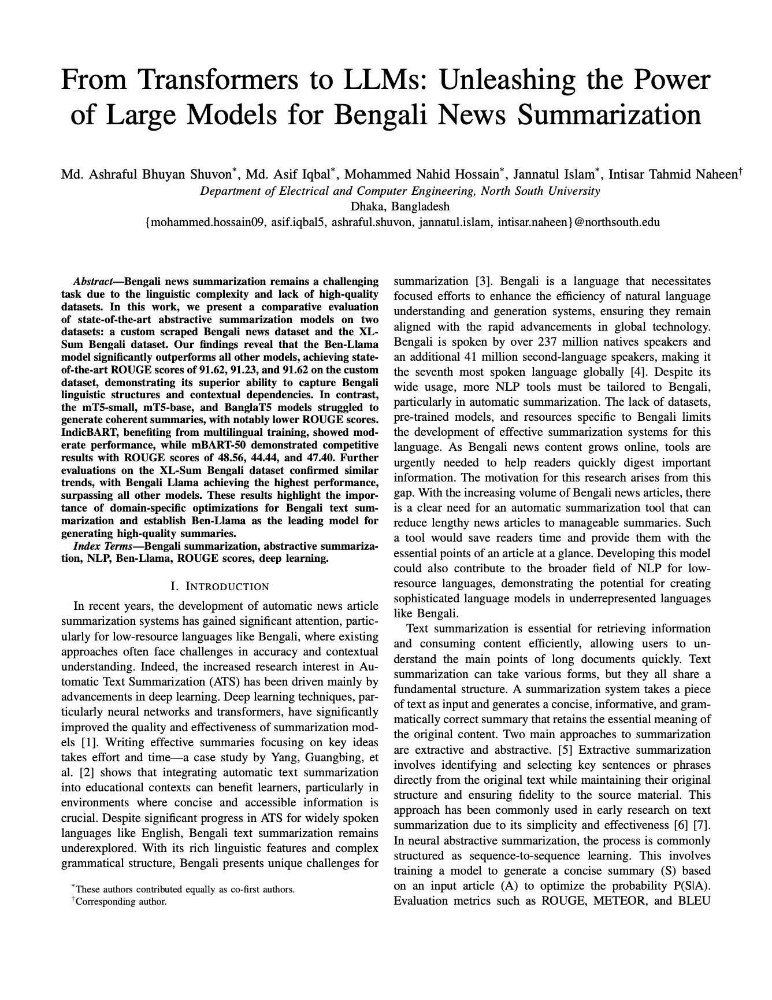

## 📰 Bengali Newspaper Summarization

This project focuses on developing and evaluating advanced abstractive text summarization models for **Bengali news articles**, a low-resource language in NLP. Despite Bengali being the **7th most spoken language globally**, tools and datasets for Bengali summarization are limited. Our work bridges this gap through:

### ✨ Key Highlights

- 📚 **Custom Bengali News Dataset**
  Collected over **39,000** news articles (headline, summary, full article) from _The Daily Ittefaq_ using a custom Selenium web scraper.

- 📊 **Dataset Diversity**
  Included both our custom dataset and **XL-Sum (BBC)** for robust model evaluation and comparison.

- 🤖 **Fine-tuning SOTA Models**
  Benchmarked popular transformer models including:

  - mT5 (small & base)
  - BanglaT5
  - IndicBART
  - mBART-50
  - ✅ **Bangla LLaMA** — achieved **state-of-the-art** ROUGE scores in Bengali summarization.

- 📈 **Evaluation Metrics**
  Used ROUGE for performance comparison and to assess fluency, coherence, and factual accuracy.

- 🌐 **Real-World Applications**
  Useful for information retrieval, media analytics, content summarization apps, and research in low-resource NLP.

---

### 🧪 Research Contributions

- Creation of a **high-quality Bengali news summarization dataset**
- **Model benchmarking** across diverse multilingual and Bengali-specific models
- Demonstrated the **importance of dataset quality** for summarization performance
- Showcased the **effectiveness of LLMs like Bangla LLaMA** over traditional transformers

---

### 📦 Tech Stack

- Python • Hugging Face Transformers • PyTorch • Selenium • Jupyter Notebooks

